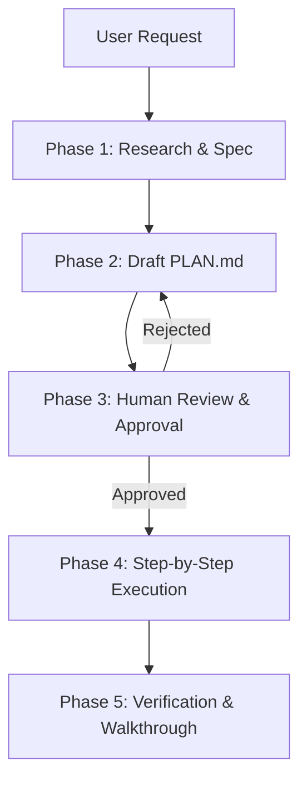

# Plan-With-File Skill (Spec-Plan-Execute Workflow)

This skill implements the highly popular GitHub community standard for agentic software development: **Planning with a persistent plan file (`PLAN.md`)**. It forces the agent to plan before coding, reducing errors and ensuring alignment.

## Workflow Overview



---

## Instructions for the Agent

When this skill is activated (either triggered by user request or by the presence of a planning task), you **MUST** follow these steps:

### Phase 1: Research & Spec
1. Do not modify any source code files yet.
2. Read the codebase, analyze dependencies, and locate files relevant to the task.
3. Search for existing patterns, conventions, or APIs that should be followed.

### Phase 2: Draft or Update `PLAN.md`
Create (or update) a `PLAN.md` file in the project root directory. Use the following structured template:

```markdown
# Implementation Plan: [Feature/Bug Name]

## User Review Required
> [!IMPORTANT]
> Highlight any breaking changes, critical design decisions, or ambiguities here.

## Open Questions
- Ask any clarifying questions that will affect the implementation.

## Proposed File Changes
Group changes by component and label them with `[NEW]`, `[MODIFY]`, or `[DELETE]`.
- `[MODIFY]` [main.gd](file:///absolute/path/to/scripts/main.gd)
- `[NEW]` [new_script.gd](file:///absolute/path/to/scripts/new_script.gd)

## Step-by-Step Task List
Break down the implementation into atomic, testable steps. Use checkbox syntax:
- [ ] Task 1: Research and map coordinates
- [ ] Task 2: Implement class X
- [ ] Task 3: Write tests

## Verification Plan
### Automated Tests
- Describe testing commands.
### Manual Verification
- Describe manual steps.
```

### Phase 3: Wait for Approval
1. Save the `PLAN.md` file.
2. Present the plan to the user, highlighting key decisions.
3. **STOP** and wait for the user to reply with approval (e.g., "Proceed" or feedback) before starting implementation.

### Phase 4: Step-by-Step Execution
1. Once approved, implement the tasks **one by one**.
2. Mark completed tasks in `PLAN.md` with `[x]` and in-progress tasks with `[/]`.
3. Do not rush. Make clean, contiguous changes. Verify code syntax and style.

### Phase 5: Verification & Completion
1. Run tests and manual validation to verify changes.
2. Update `PLAN.md` to reflect the final status.
3. Write a brief walkthrough summary of files changed.
